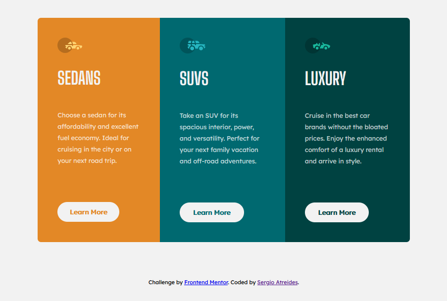

# Frontend Mentor - 3-column preview card component solution

This is a solution to the [3-column preview card component challenge on Frontend Mentor](https://www.frontendmentor.io/challenges/3column-preview-card-component-pH92eAR2-). Frontend Mentor challenges help you improve your coding skills by building realistic projects. 

## Table of contents

- [Overview](#overview)
  - [The challenge](#the-challenge)
  - [Screenshot](#screenshot)
  - [Links](#links)
- [My process](#my-process)
  - [Built with](#built-with)
  - [What I learned](#what-i-learned)
  - [Continued development](#continued-development)
  - [Useful resources](#useful-resources)
- [Author](#author)

**Note: Delete this note and update the table of contents based on what sections you keep.**

## Overview

### The challenge

Users should be able to:

- View the optimal layout depending on their device's screen size
- See hover states for interactive elements

### Screenshot

### Links

- Solution URL: [Add solution URL here](https://github.com/sergioatreides/3-column-preview-card-component)
- Live Site URL: [Add live site URL here](https://sergioatreides.github.io/3-column-preview-card-component/)

## My process

### Built with

- Semantic HTML5 markup
- CSS custom properties
- Flexbox
- CSS Grid

### What I learned

With this project I have learned to link a Github repository with my computer and publish it on Github pages.

Coding a page from a mockup has also been an interesting and surely very useful exercise.

### Continued development

Responsive design and coding from a "mobile first" perspective.

### Useful resources

- [Creating a GitHub Pages site
](https://docs.github.com/en/pages/getting-started-with-github-pages/creating-a-github-pages-site) from Github Docs - This helped me to understand how to create a page on Github.

## Author

- Website - [Sergio Atreides](https://github.com/sergioatreides)
- Frontend Mentor - [@sergioatreides](https://www.frontendmentor.io/profile/sergioatreides)
- Twitter - [@sergio_lana](https://twitter.com/sergio_lana/)

